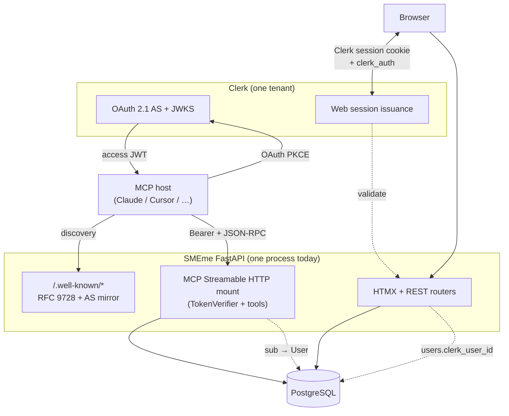
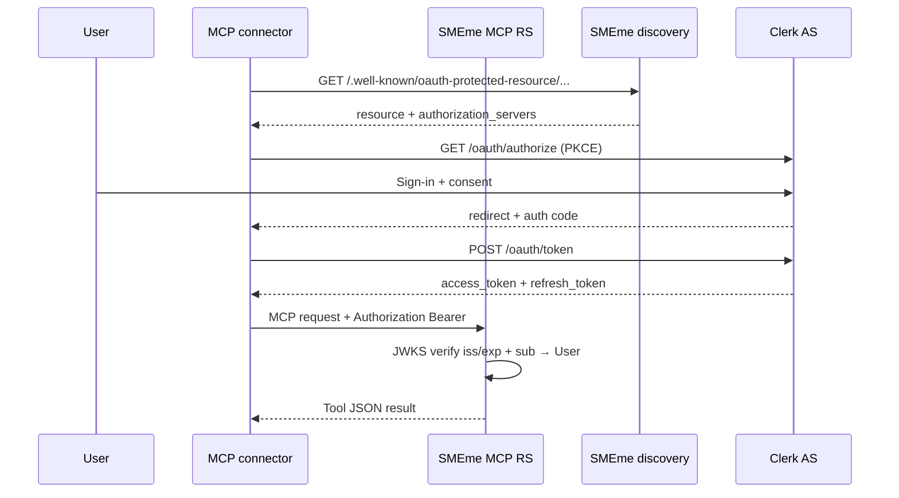
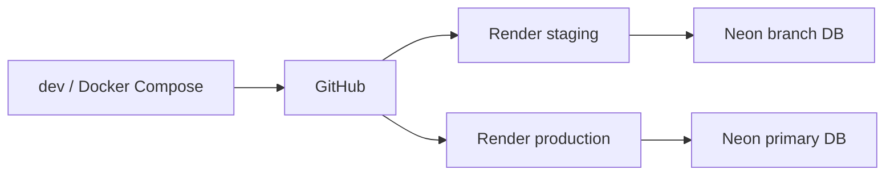

# Architecture

How the **SMEme** platform is structured today: web application, **IR-backed symbolic reasoning**, **remote MCP**, and shared infrastructure.

**Last updated:** 2026-05-07

### How this file fits the doc stack

Treat **`docs/ARCHITECTURE.md`** as **working-memory context**: the current-shape summary to load when **scoping tasks**, **onboarding**, or **resolving confusion** without reading the whole tree. When something here is too thin or ambiguous, drill into **`docs/architecture/`** (database, workflows, memo pipeline—that folder is the **reference shelf**, not the daily buffer).

For **assistant / harness runtime** (Cursor, Claude Code, CI agents), the usual **working-memory trio** is:

| Doc | Role |
|-----|------|
| **[ARCHITECTURE.md](ARCHITECTURE.md)** (this file) | System map: surfaces, auth planes, layout, where code lives |
| **[DECISIONS.md](DECISIONS.md)** | **Why** things are fixed a certain way (ADRs, especially **D016** MCP/OAuth, **D017** production reasoning vs legacy DTQ PoC) |
| **[LESSONS_LEARNED.md](LESSONS_LEARNED.md)** | **What broke** and **what worked**—integration traps, OAuth, Z3, LangGraph |

**[ROADMAP.md](ROADMAP.md)** says **what is next**; it is not a substitute for architecture or decisions.

**[User contract](product/user-contract.md)** — product narrative for **business owners**, **user testing**, and **end-user framing** (features and roadmap in plain language; not a legal agreement).

---

## What is SMEme?

Subject matter experts **author** interactive questionnaires (decision trees). End users **navigate** questions and branching; the system reaches a **conclusion** and can generate a **memo** via LLM.

**Deterministic layer:** On publish, eligible graphs compile to **validated IR** and pass **SAT enumeration** checks; **evaluate** loads the persisted IR artifact and yields outcomes (`SAT_UNIQUE`, `UNSAT`, …) with optional audit trails. Reasoning is exposed over **REST** (session-scoped, interim rules) and over **MCP** (OAuth Bearer) for external agents.

Canonical auth and MCP decisions: **[D016 — Authentication & permissions](DECISIONS.md#d016-authentication--permissions--final-plan-cowork-launch-remote-mcp-sso)**. **Symbolic reasoning:** **[D017 — DTQ PoC vs IR-first pipeline](DECISIONS.md#d017-dtq-proof-of-concept-vs-production-symbolic-reasoning-pipeline)** — the product stack lives under **`smeme/reasoning/`** (pre-cutover PoC package removed). Roadmap: **[ROADMAP.md](ROADMAP.md)**.

---

## Product shape (current direction)

| Surface | Who | Purpose |
|---------|-----|---------|
| **First-party web** | Creators + consumers | HTMX app: editor, gallery, sessions, billing, Clerk sign-in |
| **Remote MCP** | Connectors (Cowork, Cursor, Inspector, …) | Streamable HTTP + OAuth 2.1: reasoning tools for agents |
| **REST API** | Same browser session (today) | Health, reasoning preflight (owner), reasoning evaluate (session + `is_public` interim), webhooks |

**Integration stance:** External **agents** are expected to use **MCP + OAuth**, not a separate first-class public API-key product (see D016 rule 6 and [P3 sprint](planning/sprint-dr3-p3-mcp-rs-binding-metering.md) for RS binding + metering).

**Deployment stance (today):** One **FastAPI** process serves **HTMX + REST + well-known discovery + mounted MCP**. A dedicated MCP **worker** service is optional later (D016 P5).

---

## Auth planes

Identity for humans lives in **Clerk**. The **same** `User` row powers the web app (`users.clerk_user_id` ↔ Clerk `sub`) and MCP (`sub` from OAuth access JWT → local user). **Cookies and MCP Bearer tokens are not interchangeable**: the browser never “becomes” MCP auth without going through connector OAuth.

### Plane A — Browser / HTMX (first-party web)

- **Clerk** Hosted components or Account Portal: user signs in; **Clerk session** (`__session` cookie and related) is validated with the **Clerk Backend SDK** (`authenticate_request_async`, secret key, `authorized_parties` / `azp` policy).
- **FastAPI-Users** still backs the `users` table (password hash nullable when Clerk-only paths dominate); **webhooks** sync Clerk users into local rows.
- **Session cookies** protect page routes and most HTMX POSTs; some flows still expose **FastAPI-Users JWT** (`/auth/jwt/login`) for automation **inside** your trust boundary—not as the MCP story.

### Plane B — Remote MCP (OAuth 2.1 resource server)

- **Authorization Server:** **Clerk** (`/oauth/authorize`, `/oauth/token`, JWKS).
- **Resource Server:** SMEme **MCP mount** (`MCP_HTTP_PATH`, default `/api/v1/mcp`): **JSON-RPC** over **Streamable HTTP**, **`Authorization: Bearer`** with JWT verified via **JWKS** (`smeme/mcp/bearer_auth.py`).
- **Discovery:** **[RFC 9728](https://www.rfc-editor.org/rfc/rfc9728.html)** protected resource metadata and mirrored **AS / OIDC** documents on **SMEme’s origin** (CORS-safe for browser-based inspectors)—see `smeme/mcp/discovery_routes.py`.
- **Dynamic Client Registration:** **On** for SaaS prod (Clerk instance + **`CLERK_OAUTH_DYNAMIC_REGISTRATION=true`**). **`SMEME_MCP_ALLOWED_OAUTH_CLIENT_IDS` blank** on SaaS. Self-hosted may keep DCR off + static **`oauth.clientId`** + optional allowlist (see DR-3 guide).

P3 hardening: **OAuth client allowlist** code shipped (optional for self-hosted); **`aud`** benched on SaaS when Clerk does not emit stable audience.

### Auth plane diagram (components)



### Auth plane diagram (MCP OAuth sequence)



---

## Principles

1. **HTMX / Jinja first** — No SPA framework; server-rendered HTML and partials.
2. **LangGraph idiomatic** — TypedDict state; nodes as functions; **no DB sessions in graph state** (use `RunnableConfig["configurable"]`).
3. **Two-workflow QNR** — **Viewer** (cached reads) vs **Editor** (fresh writes + validation).
4. **Tiered validation** — Lenient while editing; **strict** on publish (**`validate_graph_for_publication`** + IR compile and **`enumerate_conclusion_sat_queries`** via **`assess_publish_readiness`** in **`smeme/reasoning/publish_readiness.py`** per [D017](DECISIONS.md#d017-dtq-proof-of-concept-vs-production-symbolic-reasoning-pipeline)).
5. **Immutable graph ops** — Editor operations return new graph copies; no in-place mutation of shared structures.
6. **Honest OAuth metadata** — MCP clients must see **Clerk** as AS in discovery, not fake local token endpoints.
7. **Spec alignment** — MCP authorization guides transport and audience expectations; see [MCP Authorization](https://modelcontextprotocol.io/specification/2025-11-25/basic/authorization).

---

## Tech stack

| Layer | Technology |
|-------|------------|
| Runtime | Python 3.12+, FastAPI, Uvicorn |
| UI | Jinja2, HTMX, Tailwind (design tokens / macros) |
| Data | PostgreSQL 16+, **Neon** in practice, SQLModel / SQLAlchemy 2, Alembic |
| Web identity | **Clerk** (session + backend API + webhooks) |
| Legacy / bridge | FastAPI-Users patterns, **JWT** for selected API use |
| AI | **LangGraph**, **OpenAI** SDK, **Tavily** (agentic research) |
| Determinism | **Z3** (`z3-solver`); **IR-first pipeline** in **`smeme/reasoning/`** (QNR→IR, **`validate_ir`**, **`compile_ir_to_z3`**, **`enumerate_conclusion_sat_queries`**, **`evaluate_reasoning`**); publish and REST/MCP evaluate **persisted IR** via **`reasoning_compiled_artifacts`** ([D017](DECISIONS.md#d017-dtq-proof-of-concept-vs-production-symbolic-reasoning-pipeline)) |
| Remote agents | **`mcp` SDK** + **FastMCP**, Streamable HTTP |
| Billing | **Stripe** (Premium, sessions, webhooks) |
| Observability | Structured logging, wizard telemetry (Postgres) |

---

## Repository layout

```
plugin/
└── cowork-skills/          # Agent Skills source (guidance / rubric authoring)

smeme/
├── main.py                 # App factory, middleware order, router includes, MCP mount
├── core/                   # settings, db, models, middleware, rate limits, logging
├── auth/                   # routes, Clerk sync, webhooks, profile
├── api/                    # health, reasoning_preflight, reasoning_evaluate
├── billing/                # Stripe routes + logic
├── gallery/                # Public QNR gallery
├── memo/                   # Memo LangGraph workflow + routes
├── mcp/                    # discovery_routes, bearer_auth, reasoning_fastmcp (tools)
├── reasoning/              # IR, validate, theory/Z3, publish_readiness, runtime evaluate; ``qnr_bridge`` for QNR→IR — D017
├── qnr/                    # dashboard, editor, viewer, generation
│   ├── editor/             # graph ops + routes
│   ├── viewer/             # cached read workflow + SVG
│   └── generation/         # simple + agentic LangGraph
└── templates/              # Jinja2 + partials
```

---

## HTTP surface (representative)

| Prefix / path | Role |
|---------------|------|
| `/auth/*`, `/auth/clerk/*` | Login, profile, Clerk callback/logout contract |
| `/auth/clerk/webhook` | Clerk user sync (Svix secret) |
| `/qnr/*`, `/qnr/editor/*`, `/qnr/view/*`, `/qnr/generation/*` | Product UI + workflows |
| `/marketplace`, `/gallery`, `/creator/{slug}` | Discovery & profiles (slug = email-derived `users.username` until Business-tier creator aliases) |
| `/billing/*` | Premium + revenue (Stripe) |
| `/api/v1/health` | Health |
| `/api/v1/qnr/.../reasoning/*` | REST reasoning preflight + evaluate (session + owner rules) |
| `/.well-known/oauth-protected-resource/...` | RFC 9728 for MCP `resource` |
| `/.well-known/oauth-authorization-server` (mirror) | AS metadata (no 302 to Clerk for browser clients) |
| `MCP_HTTP_PATH` (default `/api/v1/mcp`) | Streamable HTTP MCP (not in OpenAPI) |

---

## Symbolic reasoning (IR + Z3)

**Stack ([D017](DECISIONS.md#d017-dtq-proof-of-concept-vs-production-symbolic-reasoning-pipeline)):** The **IR-first** pipeline lives under **`smeme/reasoning/`** (compiler, validator, theory, runtime, publish readiness). **Handoff for agents:** [`smeme/reasoning/README.md`](../smeme/reasoning/README.md).

**IR pipeline:** QNR → IR via **`smeme.reasoning.qnr_bridge`**, then **`validate_ir`** (`ir/validate.py`): graph integrity, single entry, DAG, and typed **non-default** guards for **checkbox**, **radio**, **text**. **`compile_ir_to_z3`** assumes **`validate_ir(ir).valid`** and does **not** call **`validate_ir`** again; feeding raw IR can **`KeyError`** during guard wiring. **`enumerate_conclusion_sat_queries`** (base `SAT(T(IR))`, per-conclusion, pairwise conclusions) is the **publish** gate; **`solve_reachability_witness`** is debug/smoke only. Runtime evaluation uses **`evaluate_reasoning`** on persisted IR. **`validate=False`** and calling **`compile_ir_to_z3`** alone remain escape hatches for tests; when tightening boundaries, see README **Future: harder “validated IR” boundary**.

**Publish path:** **`assess_publish_readiness`** (`smeme/reasoning/publish_readiness.py`): **`validate_graph_for_publication`** → **`compile_qnr_to_ir`** → **`validate_ir`** → **`enumerate_conclusion_sat_queries`**. On success → persist **`reasoning_compiled_artifacts`**; QNR **`reasoning_status`** reflects compilation.

**Evaluate path:** **`evaluate_reasoning`** loads **`ReasoningCompiledArtifact.ir_json`**, checks **`graph_hash`**, runs Z3; optional **persist** to **`reasoning_evaluation_runs`**.

**MCP tools:** `smeme_reasoning_capabilities`, `smeme_reasoning_list`, `smeme_reasoning_evaluate`, and (when **`MCP_REASONING_BLOB_TOOL_ENABLED=true`**) `smeme_reasoning_evaluate_blob` — see `smeme/mcp/reasoning_fastmcp.py`; all require resolved local **User** after Bearer verification. Worksheet tools **`smeme_reasoning_template_check`** / **`smeme_reasoning_template_get`** are always registered when MCP is mounted. Blob evaluate defaults **off** at the MCP surface (implementation remains for tests and opt-in).

### Capability surface, MCP tools, and metering (future work)

This is the **target** way to extend reasoning tools (and admin surfaces); implementation is tracked under [P3 — RS binding + metering](planning/sprint-dr3-p3-mcp-rs-binding-metering.md) and follow-on work—not all of it is shipped yet.

**Domain function vs MCP tool**

| Layer | What “building” means |
|-------|------------------------|
| **Domain function** | Typed inputs, validation, owner/authz rules, calls `evaluate_reasoning` / repos, returns structured data (dict/dataclass). No FastMCP, Starlette `Request`, or JSON-RPC. **Core:** `smeme/reasoning/` ([D017](DECISIONS.md#d017-dtq-proof-of-concept-vs-production-symbolic-reasoning-pipeline)). |
| **REST adapter** | FastAPI route + Pydantic; session / `Depends`; calls the **same** domain function. |
| **MCP tool** | Thin adapter: `Context` → `get_mcp_user` → same domain function → **JSON string** for the wire; failures via `smeme/mcp/tool_contract.py` stable **`error.code`** values; LLM-facing **name + description** on the `@tool`. |

New agent-facing behavior should **start** as a domain function + tests, then get **two** thin bindings (REST if needed, MCP for connectors). Shared **error codes** and (eventually) a small **capability registry** keep Cowork skills, docs, and admin copy from drifting.

**Metering tied to auth (planned)**

Billable / analytic events should record **identity the server already trusts**, in order:

1. Transport Bearer verified (`iss`, `exp`, …).  
2. Local **`User`** resolved (`get_mcp_user`).  
3. **Then** run domain logic; **then** persist a **success** metering row with at least **`user_id`**, **`tool_name`**, **time**, and optional **`qnr_id`**.

Optional column **`oauth_client_id`** (from JWT `client_id` / `azp` once extracted) ties usage to **which connector** and lines up with **OAuth client allowlists** (same P3 track). Do not attribute successful tool completions to a user if auth did not finish in the same request. Transport-only **401** traffic can use separate security telemetry (`user_id` null) so product metrics stay clean.

**Further out:** machine-readable **tool manifest** for admin dashboards; quota enforcement on top of metering rows.

---

## LangGraph (QNR generation)

Agentic generation uses **subgraphs** (research → design → build) with checkpointing. **State must declare every field** that must survive between nodes (`TypedDict`, `NotRequired`). **Database sessions** are passed through **`config["configurable"]`**, not stored in state.

---

## Data model (condensed)

- **`users`** — Core identity; **`clerk_user_id`** links MCP/OIDC `sub`; Stripe **premium** fields; creator profile metadata.
- **`qnrs`** — Versioned graph **`graph_data`**, **`reasoning_status`**, **`cevi_legal`** (ontology-validation intent at publish), publish/economics fields (`is_public`, pricing, audience metadata, …). See **`is_public`** below.
- **`qnr_research_corpora`** — Optional **one row per QNR**: SME **research corpus** text (agentic save and internal merge); **publish** reads a normalized snapshot and records **`research_corpus_hash`** on the artifact (and in contract provenance), not “latest corpus” at evaluate time ([`evidence_contract.md`](../smeme/reasoning/evidence_contract.md) §4, [`sprint-cevi-corpus-induction.md`](planning/sprint-cevi-corpus-induction.md)). The **editor** no longer exposes a monolithic corpus textarea for CEVI; author interpretive edits live in **`qnr_lexicon_drafts`** ([`sprint-cevi-lexicon-editor.md`](planning/sprint-cevi-lexicon-editor.md)).
- **`qnr_lexicon_drafts`** — One row per QNR: normalized **Evidence Lexicon** draft (`body_json`, `lexicon_hash`, `graph_hash_at_save`); merged into CEVI induction on publish when the draft matches the current graph ([`sprint-cevi-lexicon-editor.md`](planning/sprint-cevi-lexicon-editor.md)).
- **`reasoning_compiled_artifacts`** — One row per compiled QNR: **`ir_json`**, **`graph_hash`**, **`research_corpus_hash`** (nullable), compiler metadata, **`cevi_contract_json` / `cevi_contract_hash`** (**PublishedEvidenceContract**, deterministic baseline plus matching author Lexicon draft), plus legal ontology enrichment status fields. **Publish-time CEVI** does **not** use open-web search or automatic LLM enrichment in this path; **`cevi_legal`** is copied into provenance for legal ontology enrichment ([`evidence_contract.md`](../smeme/reasoning/evidence_contract.md) §2). **Editor:** the deterministic contract unlocks Lexicon editing; legal ontology enrichment is displayed as a non-blocking status layer (see [`editor_lexicon_availability.py`](../smeme/reasoning/cevi/editor_lexicon_availability.py)). **Tavily** remains in **agentic QNR generation** only—not in the contract freeze path.
- **`reasoning_evaluation_runs`** — Audit rows for evaluate calls (**`caller_user_id`**, outcome, explanation JSON, triggered edges, …).
- **`qnr_sessions`**, **`memos`** — Interactive sessions and LLM memos.
- Additional tables for **billing**, **gallery**, agentic **checkpoints**, etc.—see **`smeme/core/models.py`** and Alembic.

### `is_public` (retained column, no creator share UI)

Creator **Share / Unshare / Set private** routes and editor controls were removed in favor of **Deploy** + **Listed** (`mcp_discoverable`). The **`qnrs.is_public`** boolean remains in the schema and is still used by:

| Consumer | Role |
|----------|------|
| **`/gallery`** | Public marketplace listing (deferred — Business tier / flag-gated) |
| **Versioning** | With **`was_ever_public`**, locks editing on versions that were ever gallery-public |
| **REST evaluate** (interim) | Non-owners may evaluate when `is_public` until MCP OAuth is the sole external surface |
| **Creator profile** | `public_qnrs` count on `/auth/profile` |
| **MCP `smeme_reasoning_list`** | Metadata on listed workflows |

New workflows default to `is_public=False`. Creators do **not** toggle this from the editor; **Listed** controls MCP tool-list visibility for the current product.

---

## Caching

- **Viewer / memo** — In-memory (**aiocache**) with invalidation on editor writes.
- **MCP JWKS** — In-process cache in `bearer_auth` (TTL + key rotation handling).

---

## Database & hosting

- **Neon** — Prefer **pooler** host; `pool_pre_ping`, sized pools per environment.
- **Migrations** — Alembic with a PostgreSQL **advisory lock** via **`pg_advisory_lock`** in `alembic/env.py` to avoid concurrent migrate races on small plans.
- **Render** — Typical deploy target; **`RENDER_EXTERNAL_URL`** drives canonical **`effective_base_url`** for OAuth **`resource`** URLs.

---

## Deployment (conceptual)



Production MCP URLs must match **RFC 9728** `resource` (same host/scheme as `BASE_URL` / `RENDER_EXTERNAL_URL`).

---

## Security (summary)

- **Headers, CORS, rate limiting** — Global middleware (see `smeme/core/middleware.py`, `smeme/core/rate_limiting.py`).
- **MCP** — Bearer-only on the mount; **401** + `WWW-Authenticate` with **`resource_metadata`** when transport auth is enabled.
- **Clerk** — Dashboard OAuth apps: **PKCE**, redirect URI allowlists, consent screen; **DCR** is a conscious tenant-level risk trade-off.
- **Secrets** — Env / Render secrets; never commit Clerk secrets or Stripe keys.

Details and sequence: **D016**, [DR-3 guide](guides/dr3-mcp-oauth-authoritative-sources.md), [LESSONS_LEARNED](LESSONS_LEARNED.md).

---

## Observability

- Structured **logging** (request + MCP auth telemetry where enabled).
- Structured logging; wizard funnel events in Postgres when `WIZARD_TELEMETRY_ENABLED` (no third-party workflow tracing).

---

## References

- [DECISIONS.md](DECISIONS.md) — ADRs (**D016** auth/MCP)
- [ROADMAP.md](ROADMAP.md)
- [guides/dr3-mcp-oauth-authoritative-sources.md](guides/dr3-mcp-oauth-authoritative-sources.md)
- [guides/langgraph-integration.md](guides/langgraph-integration.md)
- [planning/sprint-dr3-p3-mcp-rs-binding-metering.md](planning/sprint-dr3-p3-mcp-rs-binding-metering.md) (planned RS binding + metering)
- [plugin/cowork-skills/README.md](../plugin/cowork-skills/README.md) (guidance authoring source)
- [guides/cowork-reasoning-plugin-runbooks.md](guides/cowork-reasoning-plugin-runbooks.md) (MCP operator + end-user connector)
- Deeper dives (may lag the summary above): [architecture/database.md](architecture/database.md), [architecture/workflows.md](architecture/workflows.md), [architecture/memo-generation.md](architecture/memo-generation.md)
