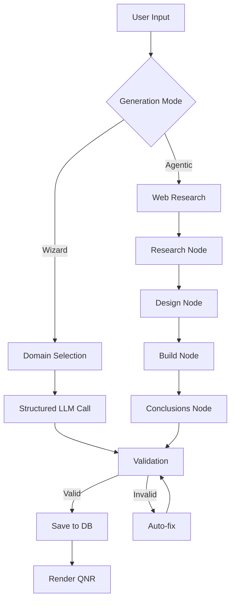
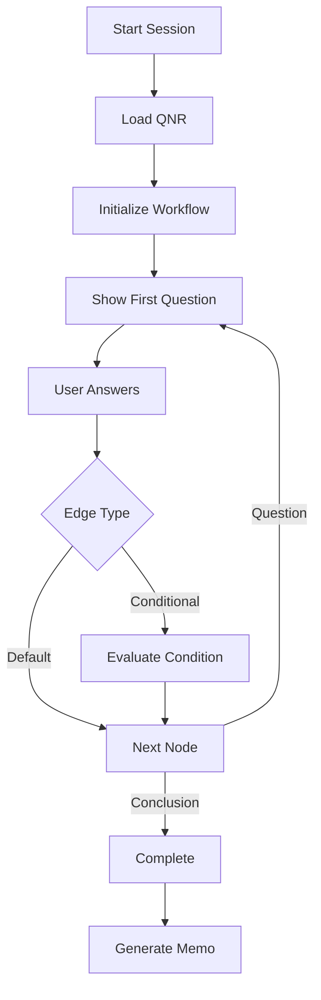

# System Architecture Overview

This document provides a high-level overview of the SMEme Platform architecture, design decisions, and key components.

## Architecture Principles

The platform is built on these core principles:

1. **Zero Technical Debt** - Clean slate, best practices only
2. **PostgreSQL First** - Built for production from day 1 (JSONB, LangGraph checkpointing)
3. **HTMX/Jinja First** - No JavaScript frameworks or bloat
4. **Type Safe** - Pydantic everywhere, mypy strict mode
5. **LangGraph Idiomatic** - Nodes are functions, state is typed (TypedDict)
6. **Minimal Dependencies** - ~22 packages (vs 50+ in legacy)
7. **Observable** - LangSmith traces every workflow
8. **Immutable Operations** - Graph operations return new copies, never mutate
9. **Two-Workflow Architecture** - Separate read (viewer) and write (editor) workflows
10. **Tiered Validation** - Lenient during editing, strict on publish

## Technology Stack

### Backend

| Component | Technology | Purpose |
|-----------|-----------|---------|
| **Web Framework** | FastAPI 0.115+ | Modern async Python framework |
| **Server** | Uvicorn | ASGI server with WebSocket support |
| **Templates** | Jinja2 | Server-side HTML rendering |
| **Interactive UI** | HTMX | Dynamic content without JavaScript |
| **Database** | PostgreSQL 16+ | JSONB support, LangGraph checkpointing |
| **ORM** | SQLModel | SQLAlchemy 2.0 + Pydantic v2 integration |
| **Migrations** | Alembic | Schema evolution |
| **Auth** | FastAPI-Users | Cookie + JWT authentication |
| **Validation** | Pydantic v2 | Data validation and settings |
| **AI Workflows** | LangGraph | Stateful AI workflows |
| **LLM** | OpenAI SDK | GPT-4o, GPT-4o-mini with structured outputs |
| **Web Search** | Tavily API | Research for agentic generation |
| **Caching** | aiocache | In-memory caching (Redis-ready) |
| **Observability** | LangSmith | Workflow tracing and debugging |
| **Package Manager** | uv | Fast Python dependency management |

### Infrastructure

| Component | Technology | Purpose |
|-----------|-----------|---------|
| **Container** | Docker | Application containerization |
| **Database** | Neon (PostgreSQL) | Serverless PostgreSQL |
| **Hosting** | Render | Container deployment |
| **CI/CD** | GitHub Actions | Automated builds and deploys |
| **Registry** | GHCR | Docker image storage |

## System Components

### Core Infrastructure (`smeme/core/`)

The foundation layer providing shared services:

- **`config.py`** - Pydantic Settings for configuration management
- **`database.py`** - SQLModel database setup with connection pooling
- **`models.py`** - Core data models (User, QNR, QNRSession, Memo)
- **`dependencies.py`** - FastAPI dependency injection
- **`llm.py`** - OpenAI client configuration
- **`logging.py`** - Structured logging setup
- **`middleware.py`** - Security headers, CORS, HTMX redirects
- **`templates.py`** - Jinja2 template engine configuration

### Authentication (`smeme/auth/`)

FastAPI-Users integration for user management:

- Cookie-based sessions (httponly, samesite=lax)
- JWT Bearer token support for API access
- User registration, login, logout, password reset
- Email verification flow
- Profile management endpoints

**Key Files:**
- **`backend.py`** - Authentication backends (Cookie + JWT)
- **`manager.py`** - UserManager with custom logic
- **`models.py`** - User schemas (Read, Create, Update)
- **`routes.py`** - Auth routes and endpoints
- **`users.py`** - FastAPI-Users setup

### QNR Module (`smeme/qnr/`)

The core questionnaire system with four main subsystems:

#### 1. Generation (`qnr/generation/`)

Create questionnaires from natural language (simple flow) or the agentic pipeline:

- **Simple generation** - Topic/goal extraction + structured graph (`workflow.py`, `/qnr/generate`)
- **Agentic Mode** - Web research + multi-stage LLM reasoning (`/qnr/agentic`)
- **Structured Output** - OpenAI response_format for type-safe generation
- **Auto-fix Validation** - Intelligent retry and repair strategies

**Key Files:**
- `workflow.py` - Basic generation workflow
- `agentic/workflow.py` - Research → Design → Build → Conclusions
- `agentic/subgraphs/` - Research, design, build, conclusions subgraphs

#### 2. Editor (`qnr/editor/`)

Interactive graph editor for QNRs:

- **Graph Visualization** - SVG-based graph with hierarchical layout
- **Node Operations** - Create, update, delete question/conclusion nodes
- **Edge Operations** - Manage conditional and default edges
- **Tiered Validation** - Save first, validate second (errors don't block)
- **Versioning** - Create new versions of public QNRs
- **Archiving** - Soft-delete with restore capability

**Key Files:**
- `routes.py` - CRUD endpoints for editing
- `operations.py` - Immutable graph operations
- `workflow.py` - Write workflow with validation
- `models.py` - Editor state models

#### 3. Viewer (`qnr/viewer/`)

Read-only visualization and session navigation:

- **Graph Rendering** - Cached SVG visualization
- **Session Navigation** - Interactive questionnaire sessions
- **Path Traversal** - Track user journey through questions
- **Conclusion Tracking** - Record terminal outcomes
- **Side Panel** - Node inspection and details

**Key Files:**
- `routes.py` - Viewer endpoints
- `renderer.py` - SVG rendering engine
- `layout.py` - Graph layout algorithms (BFS hierarchy)
- `workflow.py` - Read-only, cached workflow

#### 4. Helpers (`qnr/helpers/`)

Pure utility functions (no state):

- **`cache.py`** - Caching utilities for QNR graphs
- **`db_queries.py`** - Database query helpers
- **`validation.py`** - Graph structure validation

### Memo Module (`smeme/memo/`)

AI-powered memo generation from QNR sessions:

- **Session Integration** - Generate memos from completed questionnaires
- **Structured Output** - Title, summary, recommendations
- **LangGraph Workflow** - Stateful memo generation
- **Caching** - Memos cached by session ID

**Key Files:**
- `memo_workflow.py` - Memo generation workflow
- `routes.py` - Memo endpoints
- `models.py` - Memo content models

## Data Flow

### QNR Generation Flow



### QNR Session Flow



## Database Schema

### Core Tables

- **`users`** - User accounts (FastAPI-Users)
- **`qnrs`** - Questionnaire metadata and graph (JSONB)
- **`qnr_sessions`** - User sessions with LangGraph checkpoints
- **`memos`** - Generated memos from sessions

See [Data Schema](../reference/data-schema.md) for complete details.

## Workflow Architecture

### Two-Workflow Pattern

The platform uses a **two-workflow architecture** for QNRs:

| Workflow | Purpose | Characteristics |
|----------|---------|-----------------|
| **Viewer** | Read-only navigation | Fast, cacheable, no writes |
| **Editor** | Graph modifications | Stateful, transactional, validation |

This separation provides:
- Clear boundaries between read and write operations
- Better caching strategies (viewer can cache aggressively)
- Independent scaling (more viewers than editors)
- Simpler state management

### LangGraph Integration

All workflows use LangGraph for:
- **Stateful execution** - TypedDict state with checkpointing
- **Node-based design** - Each node is a pure function
- **Conditional routing** - Dynamic flow based on state
- **Observability** - LangSmith tracing built-in
- **Error handling** - Retry strategies and fallbacks

See [LangGraph Integration Guide](../guides/langgraph-integration.md) for details.

## Deployment Architecture

### Development

```
Developer → Git Push → GitHub → Local Docker Compose
                                 ├── PostgreSQL (dev)
                                 └── PostgreSQL (test)
```

### Staging

```
Git Push (dev) → GitHub Actions → GHCR → Render (staging)
                                          └── Neon (dev branch)
```

### Production

```
Git Tag (main) → GitHub Actions → GHCR → Render (manual deploy)
                                          └── Neon (main branch)
```

See [CI/CD Setup Guide](../guides/ci-cd-setup.md) for pipeline design and [Production release runbook (internal)](../guides/internal/production-release-runbook.md) for the operator checklist (staging verify, prod env, smoke tests).

## Security

### Authentication

- **Cookie-based sessions** - httponly, samesite=lax
- **JWT Bearer tokens** - For API access
- **Password hashing** - bcrypt with passlib
- **FastAPI-Users** - Battle-tested auth framework

### Infrastructure

- **Security headers** - XSS, clickjacking protection
- **CORS** - Properly configured origins
- **HTTPS** - Enforced in production (Render)
- **Database** - Connection pooling with timeouts
- **Secrets** - Environment variables only

## Performance

### Caching Strategy

- **QNR Graphs** - Cached after first load (1hr TTL)
- **Viewer Rendering** - Cached SVG per QNR
- **Memos** - Cached by session ID
- **Cache Invalidation** - Automatic on graph updates

### Database Optimization

- **Connection Pooling** - 5-20 connections based on environment
- **JSONB Indexing** - Fast graph queries
- **Checkpointing** - LangGraph state in PostgreSQL
- **Async I/O** - All database operations async

## Observability

### Logging

- **Structured Logging** - JSON format with context
- **Log Levels** - DEBUG, INFO, WARNING, ERROR, CRITICAL
- **Request Tracking** - Request ID in all logs
- **Timing** - Performance metrics logged

### Tracing

- **LangSmith** - Complete workflow traces
- **Node-level tracking** - Input/output for each node
- **Error tracking** - Exceptions captured with context
- **Performance metrics** - Node execution times

## Testing Strategy

- **Unit Tests** - Core business logic (`pytest`)
- **Integration Tests** - API endpoints with test database
- **Workflow Tests** - LangGraph execution paths
- **Migration Tests** - Alembic upgrade/downgrade (`pytest-alembic`)
- **Serialization Tests** - LangGraph state serialization

See [Testing Guide](../contributing/testing.md) for details.

## Next Steps

- **Authentication & Profile Management** → [Auth Architecture](auth-profile.md)
- **Deep Dive into QNR System** → [QNR Architecture](qnr/)
- **Learn About Workflows** → [Workflows Guide](workflows.md)
- **Database Design** → [Database Architecture](database.md)
- **Deploy to Production** → [Deployment Guide](../guides/deployment.md)

